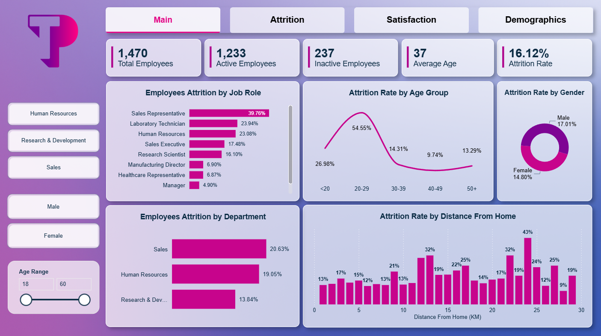

# HR Employee Attrition Analysis Dashboard

## Overview
End-to-end HR analytics case study built in Power BI to analyze employee attrition trends, identify turnover drivers, and provide actionable business recommendations using interactive dashboards and DAX measures.

---

## Business Problem
Employee attrition negatively impacts productivity, hiring costs, and organizational stability. This project analyzes workforce attrition patterns across departments, demographics, salaries, overtime, satisfaction, and travel frequency.

---

## Tools & Technologies
- Power BI
- Power Query
- DAX
- Excel / CSV
- Data Modeling (Star Schema)

---

## Dashboard Features
- Workforce Overview KPIs
- Attrition by Department & Job Role
- Demographic Analysis
- Satisfaction Analysis
- Overtime & Travel Impact
- Interactive Dashboard Filters

---

## Data Modeling
The project uses a Star Schema design with:
- FactEmployee table
- Dimension tables for Education, Department, and Satisfaction

Data cleaning and transformation were performed using Power Query.

---

## Key DAX Measures
- Attrition Rate
- Total Employees
- Active Employees
- Inactive Employees
- Satisfaction-Based Attrition Metrics

---

## Key Insights
- Employees aged 20–29 showed the highest attrition rate (~54%)
- Sales Representatives had the highest turnover rate
- Overtime employees showed significantly higher attrition
- Lower salary groups were more likely to leave
- Work-life dissatisfaction strongly correlated with attrition

---

## Business Recommendations
- Improve onboarding and career growth for younger employees
- Reduce overtime workload in high-risk teams
- Review compensation for lower income groups
- Improve work-life balance initiatives
- Support employees with frequent business travel

---

## Dashboard Preview

### Dashboard Overview

---

## Presentation
The repository also includes a presentation summarizing:
- Data modeling
- DAX calculations
- Business insights
- Recommendations
- Dashboard walkthrough

---

## Author
Omar Adel