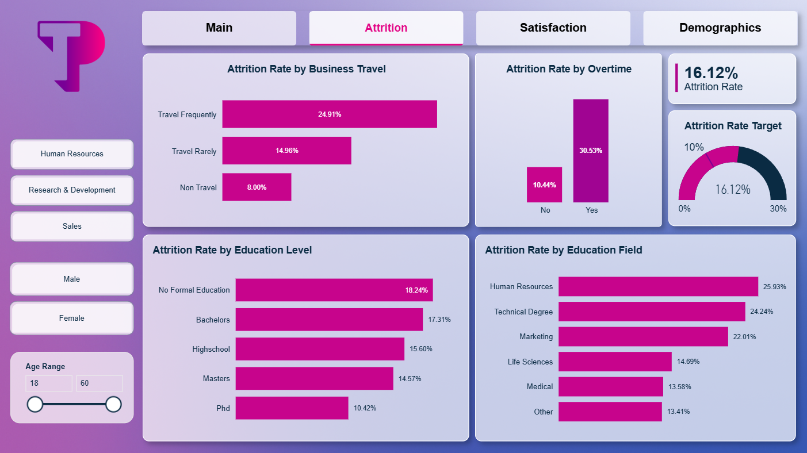
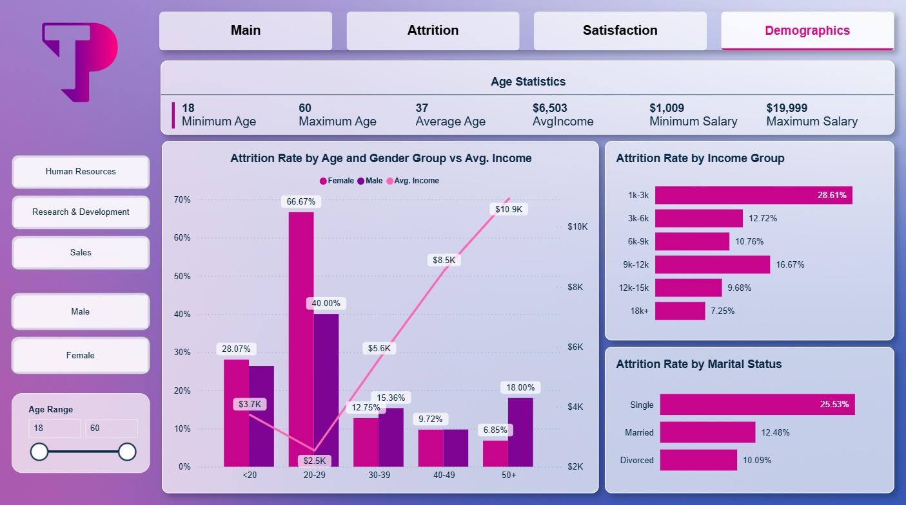
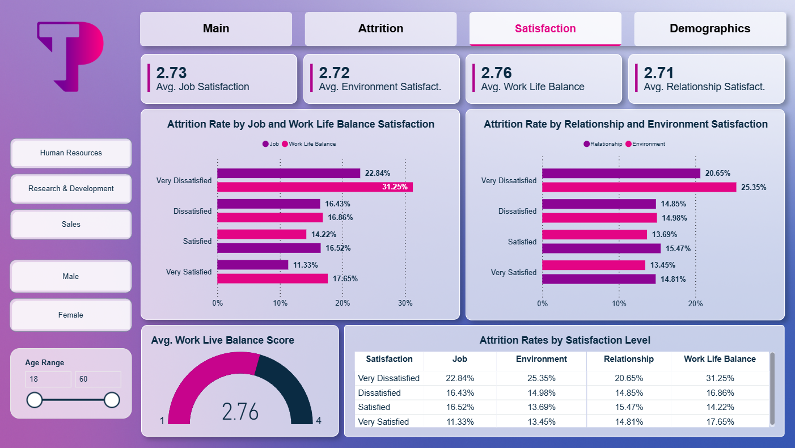

# HR Employee Attrition Analysis Dashboard

End-to-end HR analytics case study built in Power BI to analyze employee attrition trends, workforce risks, and retention insights through interactive dashboards, DAX calculations, and business recommendations.

---

## Dashboard Preview

### Workforce Overview


---

### Attrition Analysis


---

### Demographics Analysis


---

### Satisfaction Analysis


---

## Business Problem

Employee attrition negatively impacts organizational stability, productivity, and hiring costs. This project analyzes workforce attrition patterns across demographics, departments, salaries, overtime, business travel, and employee satisfaction to identify the key drivers behind employee turnover.

---

## Technologies Used

| Category | Tools |
|---|---|
| Visualization | Power BI |
| Data Transformation | Power Query |
| Calculations | DAX |
| Modeling | Star Schema |
| Dataset | CSV / Excel |
| Domain | HR Analytics |

---

## Dashboard Features

- Workforce Overview KPIs
- Attrition by Department & Job Role
- Demographic Analysis
- Satisfaction & Attrition Analysis
- Overtime Impact Analysis
- Business Travel Analysis
- Salary & Income Analysis
- Interactive Dashboard Filtering

---

## Data Modeling

The dashboard was designed using a Star Schema model for optimized analytical reporting.

### Fact Table
- FactEmployee

### Dimension Tables
- DimEducation
- DimDepartment
- DimSatisfaction

Data cleaning, transformation, and modeling were performed using Power Query.

---

## Key DAX Measures

### Attrition Rate

```DAX
AttritionRate = 
VAR YesAttrition = CALCULATE([TotalEmployees],FactEmployee[Attrition] = "Yes")
VAR Employees = DISTINCTCOUNT (FactEmployee[EmployeeNumber])

RETURN
DIVIDE(YesAttrition, Employees, 0)
```

### Total Employees

```DAX
TotalEmployees = DISTINCTCount(FactEmployee[EmployeeNumber])
```

### Active Employees

```DAX
ActiveEmployees = CALCULATE([TotalEmployees], FactEmployee[Attrition] = "No")
```

### Inactive Employees

```DAX
InactiveEmployees = CALCULATE([TotalEmployees], FactEmployee[Attrition] = "Yes")
```

---

## Workforce Overview

| KPI | Value |
|---|---|
| Attrition Rate | 16.12% |
| Total Employees | 1,470 |
| Average Age | 37 Years |
| Average Income | $6,503 |

---

## Key Insights

- Employees aged 20–29 showed the highest attrition rate (~54%)
- Sales Representatives had the highest turnover rate at 39.76%
- Employees working overtime showed significantly higher attrition
- Lower salary groups were more likely to leave the company
- Frequent business travelers showed increased turnover rates
- Work-life dissatisfaction strongly correlated with attrition
- Minimal attrition difference was observed between male and female employees

---

## Business Recommendations

- Improve onboarding and career growth programs for younger employees
- Redesign high-turnover roles such as Sales Representatives and Lab Technicians
- Reduce overtime workload in high-risk teams
- Review compensation for lower income employee groups
- Improve work-life balance initiatives
- Support employees with frequent business travel through schedule flexibility

---

## Repository Structure

```text
hr-employee-attrition-analysis-powerbi/
│
├── data/
│   ├── WA_Fn-UseC_-HR-Employee-Attrition.csv
│   └── WA_Fn-UseC_-HR-Employee-Attrition.xlsx
│
├── images/
│   ├── dashboard-overview.png
│   ├── attrition-analysis.png
│   ├── demographics-analysis.png
│   └── satisfaction-analysis.png
│
├── presentation/
│   └── TP-Employee-Attrition-Presentation.pptx
│
├── Employee-Attrition-Dashboard.pbix
└── README.md
```

---

## Presentation

The repository also includes a presentation covering:

- Data Modeling
- Dashboard Walkthrough
- DAX Calculations
- Business Insights
- Workforce Analysis
- Strategic Recommendations

---

## Skills Demonstrated

- Power BI Dashboard Development
- HR Analytics
- DAX Calculations
- Data Modeling
- Star Schema Design
- Power Query Transformation
- KPI Reporting
- Business Insight Generation
- Executive Reporting
- Analytical Storytelling

---

## Author

Omar Adel Farahat
